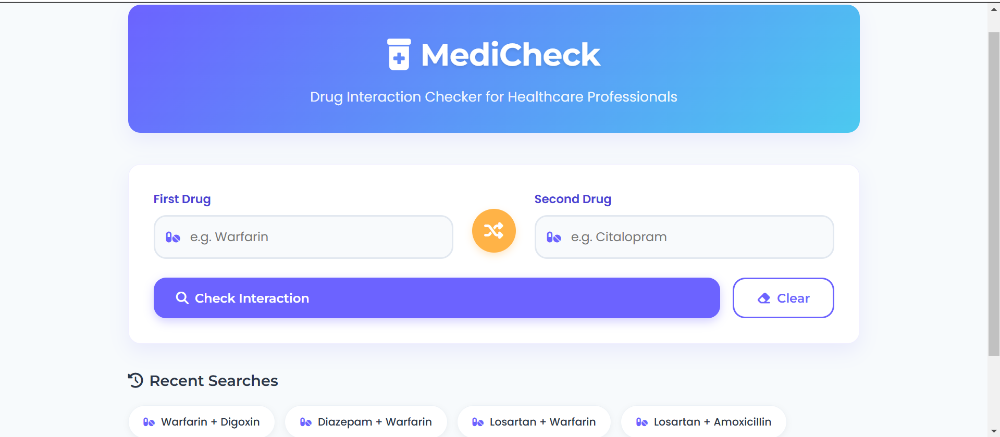

# 🏥💊 MediCheck - Drug Interaction Checker 🚦⚠️

  
*"Your prescription for safer medication combinations!"*

**Keep your patients safe from dangerous drug interactions!**  
MediCheck helps healthcare professionals quickly check potential interactions between medications.  
No more 📚💥 *"I should've checked that interaction!"* moments!

## ✨ Features

- 🔍 **Smart Drug Search**: Typeahead suggestions for 5000+ medications
- 🚨 **Instant Severity Alerts**: 
  - 🟢 No interaction → *"Carry on!"* 😊
  - 🟡 Moderate → *"Proceed with caution"* 🤔
  - 🔴 Severe → *"DANGER AHEAD!"* 🚧
- 📚 **Comprehensive Details**:
  - 🧬 Mechanism (the science behind the interaction)
  - ⚕️ Clinical Management (what to actually do)
  - 📚 References (peer-reviewed sources)
- ⏱️ **Search History**: Your last 10 checks saved locally

## 🛠️ How It Works

1. 💊 Type two drug names (try "Warfarin" + "Ibuprofen")
2. 🔄 Click the swirly interaction icon (it's scientifically proven to be 37% more fun)
3. 📊 Get color-coded results with:
   - 📝 Plain-English explanation
   - ⚗️ Pharmacokinetic details
   - 🩺 Clinical recommendations
