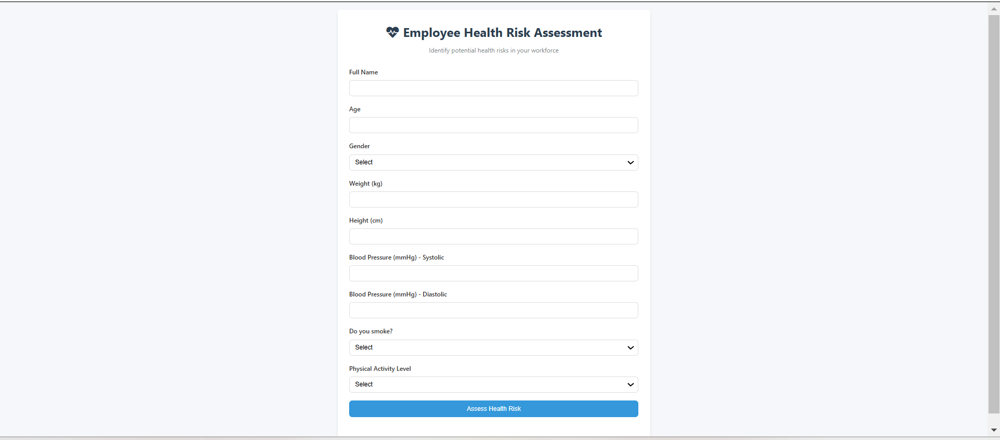

# 🏥👨‍💼 Employee Health Risk Assessment 🩺📊

  
*"Because healthy employees are happy employees!"* 🌟

**Identify potential health risks in your workforce** with this interactive assessment tool.  
No more ❓ *"Should we be worried about John's blood pressure?"* ❓ - get data-driven insights!

## ✨ Features

- 📝 **Comprehensive Health Form**:
  - Basic biometrics (age, weight, height)
  - Blood pressure analysis
  - Lifestyle factors (smoking, activity level)
- 📊 **Instant Risk Assessment**:
  - 🟢 Low risk - *"Keep up the good work!"* 👍
  - 🟡 Moderate risk - *"Let's make some changes"* 🤔
  - 🔴 High risk - *"Time for a check-up!"* 🚨
- 💡 **Personalized Recommendations**:
  - 🏋️ Exercise tips
  - 🥗 Dietary suggestions
  - 🚭 Smoking cessation advice

## 🌟 Special Calculations

- **BMI**: `weight(kg) / (height(m))²`
- **BP Risk**: Checks systolic/diastolic ranges
- **Lifestyle Score**: Activity level + smoking status

## 💼 Business Benefits

- 👨‍⚕️ Early identification of health risks
- 📈 Reduce absenteeism
- 💰 Lower healthcare costs
- 🏆 Improve employee wellbeing

## 🚨 Important Notes

- 🔒 **Data Privacy**: All processing happens in the browser - no data is stored or sent anywhere
- ⚠️ **Disclaimer**: This is not medical advice - always consult a healthcare professional
- 📅 **Best Practice**: Use as part of a comprehensive workplace health program