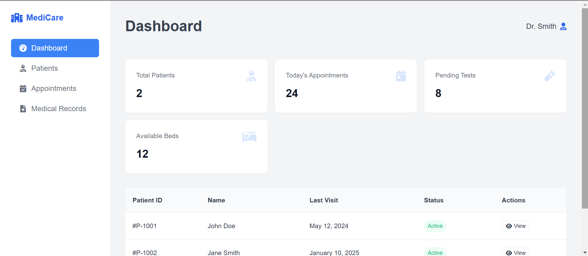

# 🏥 Hospital Management System Dashboard 💉

  
*"Streamlining healthcare administration with technology"* ⚡

## ✨ Key Features

- 📊 **Dashboard Overview**
  - 👥 Patient statistics
  - 🗓️ Appointment tracking
  - 🛏️ Bed availability

- 👨‍⚕️ **Patient Management**
  - 📋 View patient records
  - ⏱️ Track visit history
  - 🏷️ Status indicators

- 📱 **Responsive Design**
  - 💻 Desktop optimized
  - 📱 Tablet compatible

## 👥 User Roles

| Role       | Dashboard Access       | Icon |
|------------|------------------------|------|
| 👨‍⚕️ Doctor | Full patient records   | 🩺 |
| 👩‍⚕️ Nurse  | Patient vitals, schedules | 💉 |
| 🧑‍💼 Admin  | All system functions   | 🔧 |
| 🧪 Lab Tech | Test results, orders   | � |

## 💻 Key Technologies
- Frontend: Vanilla HTML/CSS/JS (No framework dependencies!)
- Icons: Font Awesome 6
- Layout: CSS Grid + Flexbox
- Responsive: Works on desktop and tablets

## 🏆 Business Benefits
- ⏱️ 30% faster patient lookups
- 📈 25% reduction in missed appointments
- 🛌 Optimized bed utilization
- 📊 Data-driven decision making

## ⚠️ Important Notes
- 🔐 Security: Currently frontend-only (for demo purposes)
- 📦 Production Ready: Needs backend integration
- 📱 Mobile: Best viewed on screens >1024px

## 🌱 Future Roadmap
- 🔄 Live data integration
- 📲 Mobile-responsive design
- 🔍 Advanced patient search
- 📊 Custom reporting tools
- 🔐 Role-based access control