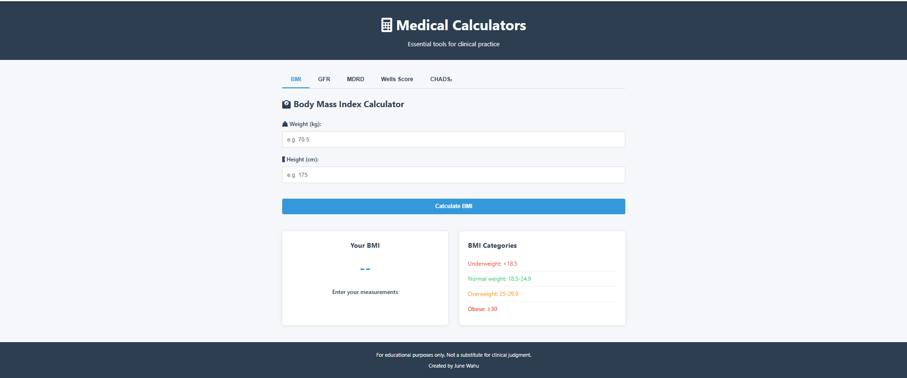

# 🏥 Advanced Medical Calculators ⚕️🧮

  
*"Essential clinical tools at your fingertips!"* ✨⚕️📱

## 🌟 Key Features

### 📊 Comprehensive Calculator Suite
| Calculator | Purpose | Key Inputs | Icon |
|------------|---------|------------|------|
| 🏋️ BMI | Weight classification | Weight, Height | 📏 |
| 🩸 GFR | Kidney function assessment | Age, Sex, Creatinine | 🧪 |
| 🧪 MDRD | Alternative GFR calculation | + Race factor | 🔍 |
| 🫁 Wells' | PE probability | 7 clinical criteria | ⚠️ |
| ❤️ CHADS₂ | AF stroke risk | 5 risk factors | 💓 |

### 🎨 Intuitive Interface
- 🔢 Clean input forms with validation
- 🎯 One-click calculations
- 📊 Color-coded result indicators:
  - 🟢 Normal range
  - 🟡 Caution range
  - 🔴 Critical range
- 📖 Built-in interpretation guides
- 🏷️ Tab-based navigation system

### ⚡ Clinical Benefits
- ⏱️ Saves calculation time during rounds
- ✅ Eliminates manual formula errors
- 📚 Includes latest reference ranges
- 📱 Fully responsive for mobile use
- 🖨️ Printable results option

## 🚀 Quick Start Guide
1. Clone the repository
2. Open `index.html` in any modern browser
3. Try these sample calculations:
   - **BMI**: 70kg, 175cm → Normal weight (22.9)
   - **GFR**: 45yo male, Cr 120 → Stage 3a CKD (58 mL/min)
   - **CHADS₂**: CHF + HTN + Age 75 → Score 3 (mod-high risk)

## 🏥 Clinical Applications
### Ideal for:
- 🎓 Medical students learning clinical scoring
- 👨‍⚕️ Residents during patient rounds
- 🏥 Hospital wards without EMR calculators
- 🏡 Community clinic quick references
- 📱 Mobile clinical decision support

## ⚠️ Important Disclaimers
❗ **For educational purposes only**  
❗ Always verify with current clinical guidelines  
❗ Does not store or transmit patient data  
❗ Not a substitute for professional judgment  
❗ Double-check critical calculations manually  

## 🌱 Future Development Roadmap
### Core Enhancements:
- 🔄 Calculation history tracking
- 📊 Graphical trend visualization
- 📤 PDF export functionality
- 🔔 Important result alerts

### Technical Improvements:
- 🌐 Multi-language support
- 📱 Progressive Web App version
- 🔗 API for EHR integration
- 🧩 Plugin architecture for new calculators

## 🛠️ Technical Specifications
- Built with: HTML5, CSS3, JavaScript
- No backend required (client-side only)
- localStorage for temporary data
- Bootstrap 5 for responsive design
- Works on all modern browsers

## 🤝 Contribution Guidelines
1. 🍴 Fork the repository
2. 📝 Add new calculators (see `/js/calculators`)
3. 🧪 Test your changes thoroughly
4. 🔀 Submit a pull request

## 📜 License
MIT License - Free for clinical and educational use

---

**Precision in Practice!** ⚕️📊🎯