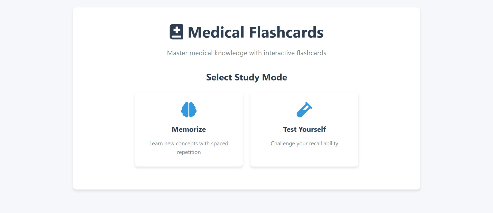

# 🩺 Medical Flashcards 🧠✨

  
*"Turn study time into active recall time!"* ⏳⚡

## 🌟 Features

### 📚 Study Modes
| Mode | Description | Best For | Icon |
|------|------------|----------|------|
| � Memorize Mode | Spaced repetition system | Learning new concepts | 🧠 |
| 🧪 Test Mode | Active recall challenge | Exam preparation | 🧪 |

### 🏷️ Organized Categories
- **Core Subjects**:
  - 🦴 Anatomy 
  - 💊 Pharmacology 
  - 🔬 Pathology
  - 🦠 Microbiology 
  - ⚗️ Biochemistry 
  - 🏥 Clinical Medicine

- **Special Features**:
  - ➕ Easily expandable categories
  - 🏷️ Custom tagging system
  - 🔍 Quick search functionality

### 💡 Smart Learning Tools
- 🔖 Bookmark difficult cards
- 📊 Track progress with visual stats
- 🎯 Adaptive difficulty rating
- 🔄 Smart shuffle algorithm
- ⏱️ Session timer with breaks

## 🚀 Quick Start
1. Clone the repository
2. Open `index.html` in any modern browser
3. Choose your study mode:
   - 🧠 **Memorize Mode** for new concepts
   - 🧪 **Test Mode** for exam prep

## 📊 Study System Overview

| Feature | Benefit | Icon |
|---------|---------|------|
| Progress Tracking | Visualize your learning journey | 📈 |
| Difficulty Rating | Adapts to your knowledge level | 🎯 |
| Bookmarking | Flag tough concepts for review | 🔖 |
| Smart Shuffle | Prevents pattern recognition | 🔀 |

## 👥 Perfect For
- 🎓 Medical students (All years)
- 👨‍⚕️ Residents preparing for boards
- 🏥 Healthcare professionals maintaining certification
- 📚 Anyone learning medical concepts
- 🧑‍🏫 Educators creating teaching materials

## 💡 Pro Tips
- 🔁 Use Test Mode 2-3 days after Memorize Mode
- 📌 Bookmark cards you get wrong 3+ times
- ⚖️ Rate difficulty honestly for best results
- ⏳ Study in 25-minute Pomodoro sessions
- 🌙 Use dark mode for late-night study sessions

## ⚠️ Important Disclaimer
❗ This is an educational tool only  
❗ Always verify content with official sources  
❗ Not a substitute for comprehensive study  
❗ Consult professors for complex topics  

## 🌱 Future Enhancements
- 📱 Mobile app version (iOS/Android)
- 👥 Multi-user progress tracking
- 🗣️ Text-to-speech functionality
- 🌐 Community-shared flashcard decks
- 🎮 Gamification elements (badges, leaderboards)
- 🤖 AI-powered difficulty adjustment

## 🛠️ Technical Details
- Built with HTML5, CSS3, and JavaScript
- No backend required (runs in browser)
- localStorage for saving progress
- Responsive design (works on tablets)

## 🤝 How to Contribute
1. 🍴 Fork the repository
2. 📝 Add new flashcards (see `/cards` directory)
3. 💾 Commit your changes
4. 🔀 Create a pull request

## 📜 License
MIT License - Free for educational use

---

**Happy Studying!** 📚💡🎓