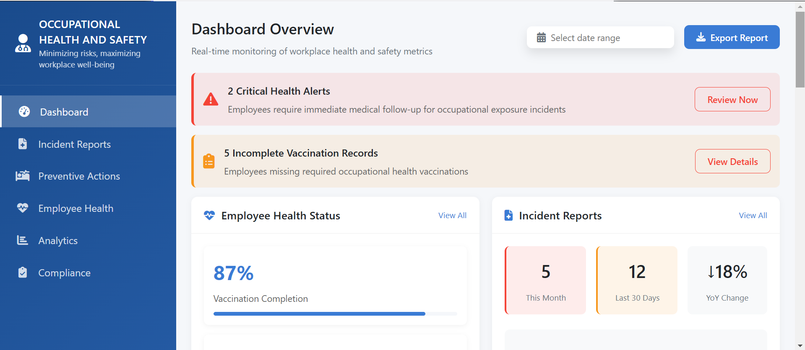

# 🏭 Occupational Health Dashboard ⚕️📊  

  
*"Protecting worker health through data-driven insights"* 🛡️👷‍♀️💼  

## 🌟 Core Features  

### 📈 Real-time Health Monitoring  
- 🚨 Critical health alerts system (color-coded by priority)  
- 📊 Employee health status tracking (individual/team views)  
- 🩺 High-risk employee identification with heatmaps  
- 🌡️ Environmental exposure level monitoring  

### 📝 Incident Management System  
- 📑 Comprehensive incident reporting (with photo uploads)  
- 📅 Historical incident analysis (5-year trends)  
- 🏷️ Smart classification by:  
  - ⚠️ Incident type (injury, illness, near-miss)  
  - 🔴 Severity level (minor/major/critical)  
  - 🏭 Department/location tagging  

### 🛡️ Preventive Health Tools  
- ✅ Safety training tracking (completion % per team)  
- 🏋️ Ergonomic assessment scoring system  
- 🧪 Hazard exposure monitoring (noise, chemicals, etc.)  
- 🩺 Periodic health screening reminders  

### 📋 Compliance Management  
- 📅 Regulatory deadline tracking (OSHA, ISO, etc.)  
- ✅ Audit-ready documentation repository  
- ⚠️ Compliance gap identification with:  
  - 🔍 Gap severity indicators  
  - 🛠️ Corrective action tracking  
  - 📧 Automated reminder system  

## 📊 Dashboard Components  

| Module            | Purpose                          | Key Metrics                     | Icon  |
|-------------------|----------------------------------|---------------------------------|-------|
| Health Alerts     | Critical notifications           | Unresolved cases, response time | 🚨    |
| Employee Health   | Workforce wellbeing monitoring   | Vaccination rates, medical clearances | 🩺    |
| Incident Reports  | Injury/illness tracking          | Monthly trends, incident types  | 📝    |
| Preventive Actions| Risk reduction programs          | Training completion, screenings | 🛡️    |
| Compliance        | Regulatory adherence             | Audit status, upcoming deadlines| 📋    |

## 🏥 Medical & Public Health Value  
- 🔍 Applies clinical knowledge to occupational settings  
- 📈 Identifies patterns in workplace illnesses/injuries  
- 🛡️ Enables proactive health interventions  
- 🌍 Demonstrates public health principles in practice  
- 📊 Supports epidemiological analysis of workplace health  

## ⚠️ Current Limitations  
- 🔌 Limited external system integrations  
- 📱 Mobile experience needs improvement  
- 👥 Single-user focused (no team collaboration)  
- 📅 Basic reporting capabilities  

## 🚀 Future Development Roadmap  

### 🔌 Integration Enhancements  
- EHR/EMR system connectivity  
- Wearable device data feeds  
- HRIS platform synchronization  

### 💻 User Experience  
- 📱 Fully responsive mobile design  
- 🎨 Customizable dashboard views  
- 🌐 Multi-language support  

### 🛠️ Advanced Features  
- 👥 Multi-user role support (HR, Safety, Medical)  
- 📤 Automated PDF report generation  
- 🔔 Smart alert notifications (SMS/Email)  
- � Predictive analytics for risk forecasting  

## 🛠️ Technical Requirements  
- Node.js 16+  
- MongoDB 5.0+  
- Modern web browser (Chrome, Firefox, Edge)  

## 📜 License  
MIT © 2025 Occupational Health Solutions  

---

**Safety First!** 🛡️👷‍♂️💙  