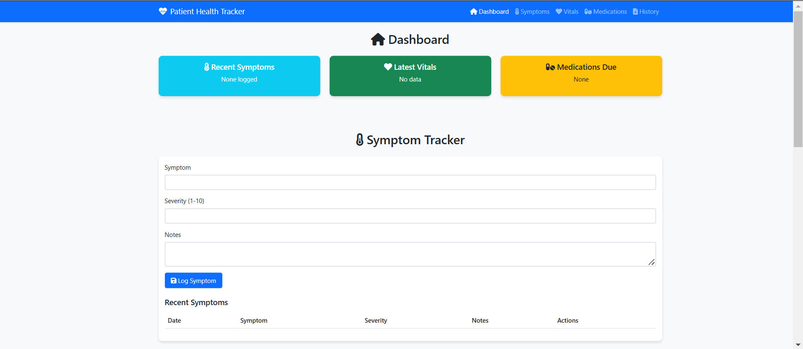

# 🏥 Patient Health Tracker 📊💖

  
*"Empowering patients through comprehensive health monitoring"* ✨

## 🌟 Features

### 📋 Dashboard Overview
- 🚨 Recent symptoms summary
- 💓 Latest vital signs
- 💊 Upcoming medication alerts

### 🤒 Symptom Tracking
- 📅 Log symptoms with severity
- 📝 Add detailed notes
- 📊 View symptom history

### ❤️ Vitals Monitoring
- 🩺 Blood pressure tracking
- 💓 Heart rate recording
- 🌡️ Temperature monitoring

### 💊 Medication Management
- 🕒 Medication schedules
- ⏰ Dosage reminders
- 🔄 Refill tracking

### 📜 Medical History
- 🏥 Doctor visit records
- 📝 Diagnosis documentation
- 📅 Timeline view

## 🏆 Key Benefits

### 👩‍⚕️ For Patients:
- ✅ Better understand health patterns
- 🏥 Prepare for doctor visits
- ⏰ Never miss medications

### 🏥 For Providers:
- 📊 Comprehensive patient data
- 📈 Trend analysis
- 💬 Improved communication

## 📱 Responsive Design
Works perfectly on:
- 💻 Desktop computers
- 🖥️ Laptops
- 📱 Mobile devices (with responsive adjustments)

## ⚠️ Important Notes
- ℹ️ This is a frontend-only demo
- 💾 All data is stored in browser localStorage
- 🚀 For production use, consider adding:
  - 🔒 User authentication
  - ☁️ Cloud backup
  - 📱 Mobile app version

## 🌱 Future Enhancements
- 📈 Advanced data visualization
- 🔔 Push notifications for medications
- 👥 Multi-user support (caregivers)
- 🏥 EHR system integration

---

**Stay Healthy!** 💖🏥