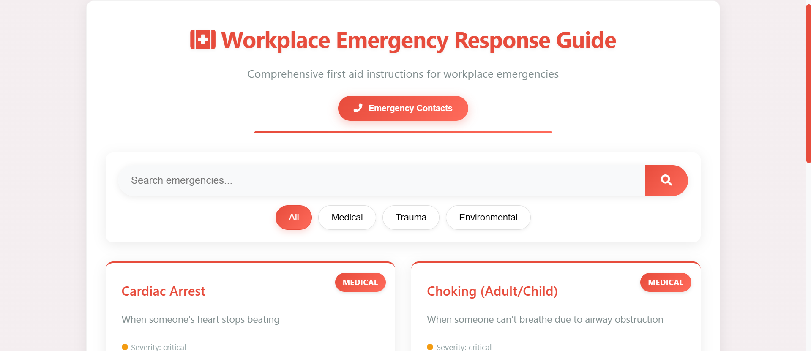

# 🚨 Workplace First Aid & Emergency Guide 🏥

  
*"Essential first aid knowledge at your fingertips"* ✋💙

## 🌟 Features

### 🆘 Comprehensive Emergency Coverage
- 💊 Medical emergencies (heart attacks, seizures)
- 🩹 Trauma injuries (cuts, burns, fractures)
- 🌡️ Environmental incidents (heat stroke, poisoning)
- ❤️ CPR/AED procedures for all ages

### 🔍 Intuitive Search System
- 🔎 Quick emergency lookup
- 🏷️ Filter by emergency type
- ⚡ Instant access to critical info

### 📋 Step-by-Step Guidance
- ✅ Clear first aid instructions
- ⚠️ "What NOT to do" warnings
- 🏥 When to seek professional help
- 📝 Printable quick-reference guides

### 📞 Emergency Contacts
- 📱 One-tap emergency numbers
- 🖨️ Printable contact list
- 🏢 Workplace-specific contacts

## 🏥 First Aid Topics Included

| Category        | Examples                  | Icon  |
|-----------------|---------------------------|-------|
| Medical         | Heart attack, Stroke, Seizure | 💊 |
| Trauma          | Bleeding, Burns, Fractures | 🩹 |
| Environmental   | Heat stroke, Poisoning, Hypothermia | 🌡️ |
| CPR/AED         | Adult/Child/Infant procedures | ❤️ |

## 💡 Why This Guide?
- ⏱️ Saves critical time in emergencies
- 📱 Always accessible (no internet needed)
- 🏢 Workplace-specific guidance
- 🆓 Free alternative to expensive first aid manuals
- 🔄 Regular content updates

## 🚨 Quick Start
1. Download the guide 📥
2. Print emergency contacts 🖨️
3. Train your team 🧑‍🏫
4. Place in accessible locations 🏢

## ⚠️ Important Disclaimer
❗ This is an informational guide only  
❗ Does not replace proper first aid training  
❗ Always call emergency services first in serious situations  
❗ Regularly update emergency contact information  

## 🌱 Future Enhancements
- 📱 Mobile app version (Coming soon)
- 🎥 Instructional videos
- 🌐 Multi-language support
- � Interactive emergency scenarios
- 📅 Training schedule integration

## 🤝 How to Contribute
1. Fork the repository 🍴
2. Create your feature branch 🌿
3. Commit your changes 💾
4. Push to the branch 🚀
5. Open a pull request 🎯

## 📜 License
MIT © 2025 Workplace Safety Team

---

**Stay Safe!** ❤️🛡️